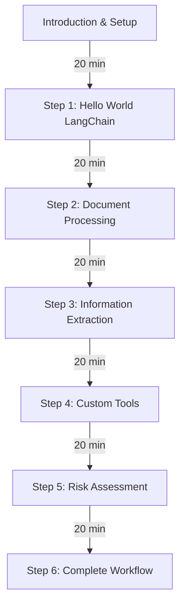

# Maritime Insurance Processing Workshop Guide

## Workshop Overview

This hands-on workshop will guide you through building a multi-step workflow using LangChain and LangGraph to process maritime insurance documents, extract key information, look up vessel and company history, and generate risk assessments.

## Workshop Duration: 2 hours

## Prerequisites

- Python 3.13+
- Basic understanding of Python
- Familiarity with Pydantic models
- OpenAI API key

## Workshop Structure



## Setup (Before Workshop)

1. Clone the repository:
   ```bash
   git clone https://github.com/oysmal/langchain-workshop-2.git
   cd langchain-workshop-2
   ```

2. Install Devbox (either):
   - See [official instructions](https://www.jetify.com/docs/devbox/installing_devbox)
   - Or, on Mac/Linux run:
     ```bash
     curl -fsSL https://get.jetify.com/devbox | bash
     ```

3. Set up your environment:
   ```bash
   cp .env.template .env.local
   # Edit .env.local to add your OpenAI API key
   ```

4. Start the Devbox shell:
   ```bash
   devbox shell
   ```

5. Install dependencies:
   ```bash
   pip install -r requirements.txt
   ```

## Introduction (20 minutes)

The instructor will present:
- Overview of LangChain and LangGraph
- Key concepts and techniques
- Maritime insurance processing workflow
- Project structure and components

## Step 1: Hello World LangChain (20 minutes)

**Branch: `step-1-hello-world`**

In this step, you'll create a simple LangChain application to understand the basics.

1. Open `src/main.py` and implement a basic LangChain chain:
   ```python
   # TODO: Implement a basic LangChain chain that:
   # 1. Takes a maritime insurance document as input
   # 2. Uses an LLM to summarize the document
   # 3. Returns the summary
   ```

2. Test your implementation:
   ```bash
   python -m src.main
   ```

**Key Concepts:**
- LangChain basics
- ChatPromptTemplate
- LLM integration
- Basic chains

**Expected Output:**
A summary of the maritime insurance document that highlights key information such as the company name, vessels, and insurance details.

## Step 2: Document Processing (20 minutes)

**Branch: `step-2-document-processing`**

In this step, you'll implement document processing to handle different file types.

1. Open `src/document_processor.py` and implement the missing methods:
   ```python
   # TODO: Implement the load_pdf method
   # TODO: Implement the load_text method
   # TODO: Implement the load_excel method
   # TODO: Implement the process_documents method
   ```

2. Update `src/main.py` to use your document processor:
   ```python
   # TODO: Use the DocumentProcessor to load and process documents
   ```

3. Test your implementation:
   ```bash
   python -m src.main
   ```

**Key Concepts:**
- Document loaders from langchain_community
- Handling different file types (PDF, text, Excel)
- Document processing without chunking
- Combining documents from multiple sources

**Expected Output:**
A list of Document objects containing the content from the PDF, text, and Excel files.

## Step 3: Information Extraction (20 minutes)

**Branch: `step-3-information-extraction`**

In this step, you'll implement structured information extraction from documents.

1. Open `src/information_extractor.py` and implement the extraction methods:
   ```python
   # TODO: Implement the _create_extraction_chain method
   # TODO: Implement the extract_entity_data method
   # TODO: Implement the extract_financial_data method
   # TODO: Implement the extract_insurance_risk_data method
   ```

2. Update `src/main.py` to use your information extractor:
   ```python
   # TODO: Use the InformationExtractor to extract structured data
   ```

3. Test your implementation:
   ```bash
   python -m src.main
   ```

**Key Concepts:**
- Structured extraction with LLMs
- Pydantic models for validation
- Extraction chains
- Prompt engineering for extraction

**Expected Output:**
Structured data objects containing entity information (company, vessels), financial data (premium, loss ratio), and insurance risk data.

## Step 4: Custom Tools (20 minutes)

**Branch: `step-4-custom-tools`**

In this step, you'll implement custom tools for looking up vessel and company history.

1. Open `src/history_lookup.py` and implement the custom tools:
   ```python
   # TODO: Implement the VesselHistoryTool._run method
   # TODO: Implement the CompanyHistoryTool._run method
   ```

2. Update `src/main.py` to use your custom tools:
   ```python
   # TODO: Use the custom tools to look up vessel and company history
   ```

3. Test your implementation:
   ```bash
   python -m src.main
   ```

**Key Concepts:**
- Custom LangChain tools
- Tool input schemas
- Error handling in tools
- Integrating external data sources (mock data in this case)

**Expected Output:**
History data for vessels and companies, including incidents and claims.

## Step 5: Risk Assessment (20 minutes)

**Branch: `step-5-risk-assessment`**

In this step, you'll implement risk assessment using LLMs.

1. Open `src/risk_assessor.py` and implement the assessment methods:
   ```python
   # TODO: Implement the assess_case method
   ```

2. Update `src/main.py` to use your risk assessor:
   ```python
   # TODO: Use the Assessor to generate a risk assessment
   ```

3. Test your implementation:
   ```bash
   python -m src.main
   ```

**Key Concepts:**
- LLM chains with structured output
- Prompt engineering for assessment
- Using Pydantic models for structured outputs
- Combining multiple data sources for assessment

**Expected Output:**
A structured assessment object containing a summary, recommendation, risk score, and points of attention.

## Step 6: Complete Workflow (20 minutes)

**Branch: `step-6-complete-workflow`**

In this step, you'll build the complete workflow using LangGraph.

1. Open `src/main.py` and implement the LangGraph workflow:
   ```python
   # TODO: Implement the create_workflow function
   # TODO: Implement the main function to run the workflow
   ```

2. Test your implementation:
   ```bash
   python -m src.main
   ```

3. Visualize the workflow:
   ```bash
   python -m utils.graph_visualizer
   ```

**Key Concepts:**
- LangGraph basics
- StateGraph
- Node functions
- Graph compilation and execution
- TypedDict for state management

**Expected Output:**
A complete workflow that processes documents, extracts information, looks up history, generates assessments, and creates a database entry.

## Project Structure

The project is organized as follows:

```
langchain-workshop-2/
├── README.md
├── requirements.txt
├── WORKSHOP_GUIDE.md          # This guide
├── test_workflow.py           # Test script
├── src/
│   ├── __init__.py
│   ├── main.py                # Entry point and workflow
│   ├── document_processor.py  # Document loading and processing
│   ├── information_extractor.py # Extract structured info
│   ├── history_lookup.py      # Custom tools for lookups
│   ├── risk_assessor.py       # Generate risk assessments
│   ├── models.py              # Pydantic models
│   ├── utils.py               # Utility functions
│   └── data/                  # Sample data files
│       ├── mock_data.py       # Mock data for lookups
│       └── [sample files]     # PDF, text, and Excel files
└── utils/
    ├── create_sample_pdfs.py  # Create sample PDFs
    └── graph_visualizer.py    # Visualize workflow graph
```

## Extensions and Next Steps

If you finish early or want to continue exploring after the workshop:

1. Add more sophisticated document processing (e.g., table extraction)
2. Implement real API calls for vessel and company history lookups
3. Add a web interface for uploading documents and viewing results
4. Implement more complex risk assessment logic
5. Add human-in-the-loop validation steps
6. Implement database storage for the processed data
7. Add error handling and retry mechanisms
8. Implement multi-vessel processing

## Resources

- [LangChain Documentation](https://python.langchain.com/docs/get_started/introduction)
- [LangGraph Documentation](https://python.langchain.com/docs/langgraph)
- [Pydantic Documentation](https://docs.pydantic.dev/)
- [OpenAI API Documentation](https://platform.openai.com/docs/api-reference)
- [LangChain Structured Output Guide](https://python.langchain.com/docs/modules/model_io/output_parsers/structured)

## Troubleshooting

### Common Issues

1. **OpenAI API Key**
   If you encounter authentication errors, check that your OpenAI API key is correctly set in `.env.local`.

2. **Import Errors**
   Ensure you've installed all dependencies from requirements.txt.

3. **File Path Issues**
   The project uses relative paths from the project root. Always run scripts from the project root directory.

4. **PDF Creation**
   If you encounter issues with sample PDFs, ensure you've run the `utils/create_sample_pdfs.py` script.

5. **Model Errors**
   If you encounter errors related to the OpenAI model, check that you're using a supported model name in your code.