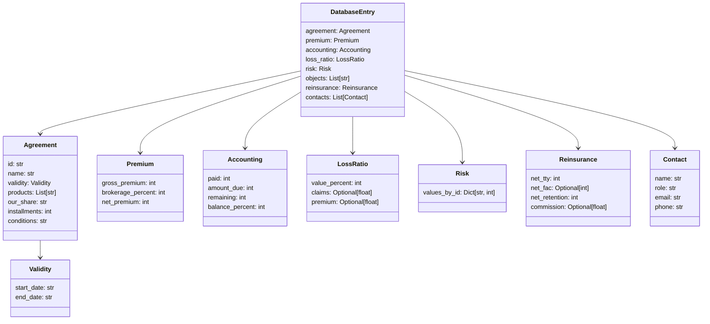

# Maritime Insurance Processing System Update Plan

## Overview

This document outlines the plan for updating the Maritime Insurance Processing System to accommodate the new database entry structure. The current system processes maritime insurance documents and creates a database entry with company, vessel, insurance, and risk assessment information. The new structure requires significant changes to the data models and processing workflow.

## Current vs. New Structure Analysis

### Current DatabaseEntry Model:
```python
class DatabaseEntry(BaseModel):
    company: Company
    vessels: List[Vessel]
    insurance: InsuranceDetails
    company_history: History
    vessel_histories: Dict[str, History]  # IMO number -> History
    assessment: RiskAssessment
```

### New db_entry Structure:
```json
{
  "agreement": {
    "id": "231454-01-R1",
    "name": "Third Party Vessels",
    "validity": {
      "start_date": "2025-06-03",
      "end_date": "2026-06-03"
    },
    "products": ["H&M", "HULL INT", "LOH", "WAR", "WAR TLO", "WAR LOH"],
    "our_share": "100%",
    "installments": 4,
    "conditions": "Nordic Plan"
  },
  "premium": {
    "gross_premium": 1838274,
    "brokerage_percent": 15,
    "net_premium": 1598499
  },
  "accounting": {
    "paid": 2097922,
    "amount_due": 293784,
    "remaining": 486378,
    "balance_percent": 62
  },
  "loss_ratio": {
    "value_percent": 0,
    "claims": null,
    "premium": null
  },
  "risk": {
    "values_by_id": {
      "04": 4,
      "08": 3,
      "12": 4,
      "14": 5,
      "16": 6,
      "18": 7
    }
  },
  "objects": [
    "Mercosul Line Navegação e Logística LTDA.",
    "Brown Water"
  ],
  "reinsurance": {
    "net_tty": 17995,
    "net_fac": null,
    "net_retention": 1580504,
    "commission": null
  },
  "contacts": [
    {
      "name": "Firstname Lastname",
      "role": "Claims Handler/Role",
      "email": "firstname.lastname@norclub.com",
      "phone": "+47 998 87 766"
    }
  ]
}
```

## Implementation Plan

### 1. Update models.py

We need to create new Pydantic models to match the new structure:



#### Specific Changes to models.py:

1. Create new model classes:
   - `Validity` - For agreement validity dates
   - `Agreement` - For agreement details
   - `Premium` - For premium information
   - `Accounting` - For accounting details
   - `LossRatio` - For loss ratio information
   - `Risk` - For risk values
   - `Reinsurance` - For reinsurance information
   - `Contact` - For contact information

2. Update the `DatabaseEntry` class to use the new models

3. Keep the existing models temporarily for backward compatibility

### 2. Update information_extractor.py

We need to create new extraction schemas to extract the required information:

1. Create `AgreementInfo` schema to extract agreement details
2. Create `PremiumInfo` schema to extract premium information
3. Create `AccountingInfo` schema to extract accounting details
4. Create `RiskInfo` schema to extract risk values
5. Create `ReinsuranceInfo` schema to extract reinsurance information
6. Create `ContactInfo` schema to extract contact information

Add corresponding extraction methods to the `InformationExtractor` class.

### 3. Update risk_assessor.py

Modify the risk assessor to:
1. Generate risk values for different risk categories (04, 08, 12, 14, 16, 18)
2. Calculate loss ratio values
3. Update the risk assessment output format

### 4. Update mock_data.py

Add mock data for:
1. Agreement details
2. Premium information
3. Accounting details
4. Risk values
5. Reinsurance information
6. Contact information

### 5. Update main.py

Modify the workflow:
1. Update the `extract_information` function to extract the new fields
2. Update the `assess_risk` function to generate the new risk structure
3. Completely rewrite the `create_db_entry` function to create the new structure
4. Update the `WorkflowState` class to include the new fields
5. Update the output formatting in the `main` function

## Implementation Steps

### Phase 1: Update Models (models.py)

1. Define the new Pydantic models in models.py:
   ```python
   class Validity(BaseModel):
       start_date: str
       end_date: str

   class Agreement(BaseModel):
       id: str
       name: str
       validity: Validity
       products: List[str]
       our_share: str
       installments: int
       conditions: str

   class Premium(BaseModel):
       gross_premium: int
       brokerage_percent: int
       net_premium: int

   class Accounting(BaseModel):
       paid: int
       amount_due: int
       remaining: int
       balance_percent: int

   class LossRatio(BaseModel):
       value_percent: int
       claims: Optional[float] = None
       premium: Optional[float] = None

   class Risk(BaseModel):
       values_by_id: Dict[str, int]

   class Reinsurance(BaseModel):
       net_tty: int
       net_fac: Optional[int] = None
       net_retention: int
       commission: Optional[float] = None

   class Contact(BaseModel):
       name: str
       role: str
       email: str
       phone: str

   class DatabaseEntry(BaseModel):
       """Final model for database entry"""
       agreement: Agreement
       premium: Premium
       accounting: Accounting
       loss_ratio: LossRatio
       risk: Risk
       objects: List[str]
       reinsurance: Reinsurance
       contacts: List[Contact]
   ```

2. Keep the existing models temporarily for backward compatibility

### Phase 2: Update Extractors (information_extractor.py)

1. Create new extraction schemas:
   ```python
   class AgreementInfo(BaseModel):
       id: str = Field(description="Agreement identifier")
       name: str = Field(description="Agreement name")
       start_date: str = Field(description="Start date of agreement validity")
       end_date: str = Field(description="End date of agreement validity")
       products: List[str] = Field(description="List of insurance products")
       our_share: str = Field(description="Our share percentage")
       installments: int = Field(description="Number of installments")
       conditions: str = Field(description="Agreement conditions")

   class PremiumInfo(BaseModel):
       gross_premium: int = Field(description="Gross premium amount")
       brokerage_percent: int = Field(description="Brokerage percentage")
       net_premium: int = Field(description="Net premium amount")

   class AccountingInfo(BaseModel):
       paid: int = Field(description="Amount paid")
       amount_due: int = Field(description="Amount due")
       remaining: int = Field(description="Remaining amount")
       balance_percent: int = Field(description="Balance percentage")

   class ReinsuranceInfo(BaseModel):
       net_tty: int = Field(description="Net TTY amount")
       net_fac: Optional[int] = Field(description="Net FAC amount")
       net_retention: int = Field(description="Net retention amount")
       commission: Optional[float] = Field(description="Commission percentage")

   class ContactInfo(BaseModel):
       name: str = Field(description="Contact name")
       role: str = Field(description="Contact role")
       email: str = Field(description="Contact email")
       phone: str = Field(description="Contact phone number")
   ```

2. Add extraction methods to the InformationExtractor class:
   ```python
   def extract_agreement_info(self, documents):
       """Extract agreement information from documents"""
       extraction_chain = self._create_extraction_chain(AgreementInfo)
       text_content = "\n\n".join([doc.page_content for doc in documents])
       results = extraction_chain.invoke(text_content)
       return [results]

   def extract_premium_info(self, documents):
       """Extract premium information from documents"""
       extraction_chain = self._create_extraction_chain(PremiumInfo)
       text_content = "\n\n".join([doc.page_content for doc in documents])
       results = extraction_chain.invoke(text_content)
       return [results]

   # Add similar methods for other extraction schemas
   ```

### Phase 3: Update Risk Assessment (risk_assessor.py)

1. Modify the RiskAssessment class to include the new risk structure:
   ```python
   class RiskAssessment(BaseModel):
       risk_score: int = Field(description="Overall risk score from 1-10, where 10 is highest risk")
       values_by_id: Dict[str, int] = Field(description="Risk values by category ID")
       company_description: str = Field(description="Brief description of the company")
       case_description: str = Field(description="Summary of the insurance case")
       recommendation: str = Field(description="Recommendation on whether to accept the insurance offer")
       loss_ratio_percent: int = Field(description="Loss ratio percentage")
   ```

2. Update the risk assessment prompt to generate the new risk structure:
   ```python
   self.risk_template = ChatPromptTemplate.from_template("""
   You are a maritime insurance risk assessor. Based on the following information, 
   provide a detailed risk assessment.
   
   Company Information:
   {company_info}
   
   Vessel Information:
   {vessel_info}
   
   Insurance Offer:
   {insurance_offer}
   
   Company History:
   {company_history}
   
   Vessel History:
   {vessel_history}
   
   Provide your assessment in a structured format with the following fields:
   - Overall Risk Score (1-10, where 10 is highest risk)
   - Risk values for specific categories:
     - 04: Technical condition (1-10)
     - 08: Operational quality (1-10)
     - 12: Crew quality (1-10)
     - 14: Management quality (1-10)
     - 16: Claims history (1-10)
     - 18: Financial stability (1-10)
   - Loss Ratio Percentage (0-100)
   - Company Description (2-3 sentences)
   - Case Description (2-3 sentences)
   - Recommendation (Accept/Reject/Request More Information)
   """)
   ```

### Phase 4: Update Mock Data (mock_data.py)

Add new mock data structures:

```python
# Mock agreement data
AGREEMENT_DATA = {
    "Bergen Shipping Company": {
        "id": "231454-01-R1",
        "name": "Third Party Vessels",
        "validity": {
            "start_date": "2025-06-03",
            "end_date": "2026-06-03"
        },
        "products": ["H&M", "HULL INT", "LOH", "WAR", "WAR TLO", "WAR LOH"],
        "our_share": "100%",
        "installments": 4,
        "conditions": "Nordic Plan"
    },
    # Add more mock data for other companies
}

# Mock premium data
PREMIUM_DATA = {
    "Bergen Shipping Company": {
        "gross_premium": 1838274,
        "brokerage_percent": 15,
        "net_premium": 1598499
    },
    # Add more mock data for other companies
}

# Add similar mock data for accounting, reinsurance, contacts, etc.
```

### Phase 5: Update Main Workflow (main.py)

1. Update the extract_information function:
   ```python
   def extract_information(state):
       """Extract key information from the documents"""
       extractor = InformationExtractor()
       company_info = extractor.extract_company_info(state["documents"])
       vessel_info = extractor.extract_vessel_info(state["documents"])
       insurance_offer = extractor.extract_insurance_offer(state["documents"])
       agreement_info = extractor.extract_agreement_info(state["documents"])
       premium_info = extractor.extract_premium_info(state["documents"])
       accounting_info = extractor.extract_accounting_info(state["documents"])
       reinsurance_info = extractor.extract_reinsurance_info(state["documents"])
       contact_info = extractor.extract_contact_info(state["documents"])
       
       return {
           "company_info": company_info,
           "vessel_info": vessel_info,
           "insurance_offer": insurance_offer,
           "agreement_info": agreement_info,
           "premium_info": premium_info,
           "accounting_info": accounting_info,
           "reinsurance_info": reinsurance_info,
           "contact_info": contact_info
       }
   ```

2. Update the create_db_entry function to create the new structure:
   ```python
   def create_db_entry(state):
       """Create the final database entry model"""
       # Extract data from state
       agreement_data = state["agreement_info"][0] if state["agreement_info"] else {}
       premium_data = state["premium_info"][0] if state["premium_info"] else {}
       accounting_data = state["accounting_info"][0] if state["accounting_info"] else {}
       reinsurance_data = state["reinsurance_info"][0] if state["reinsurance_info"] else {}
       contact_data = state["contact_info"] if state["contact_info"] else []
       assessment = state["assessment"]
       
       # Convert to model objects
       validity = Validity(
           start_date=agreement_data.start_date if hasattr(agreement_data, "start_date") else "",
           end_date=agreement_data.end_date if hasattr(agreement_data, "end_date") else ""
       )
       
       agreement = Agreement(
           id=agreement_data.id if hasattr(agreement_data, "id") else "",
           name=agreement_data.name if hasattr(agreement_data, "name") else "",
           validity=validity,
           products=agreement_data.products if hasattr(agreement_data, "products") else [],
           our_share=agreement_data.our_share if hasattr(agreement_data, "our_share") else "",
           installments=agreement_data.installments if hasattr(agreement_data, "installments") else 0,
           conditions=agreement_data.conditions if hasattr(agreement_data, "conditions") else ""
       )
       
       # Create similar conversions for other model objects
       
       # Create the database entry
       db_entry = DatabaseEntry(
           agreement=agreement,
           premium=premium,
           accounting=accounting,
           loss_ratio=loss_ratio,
           risk=risk,
           objects=objects,
           reinsurance=reinsurance,
           contacts=contacts
       )
       
       return {"db_entry": db_entry}
   ```

3. Update the WorkflowState class:
   ```python
   class WorkflowState(TypedDict, total=False):
       pdf_paths: List[str]
       text_paths: List[str]
       documents: List
       company_info: List[Dict]
       vessel_info: List[Dict]
       insurance_offer: List[Dict]
       agreement_info: List[Dict]
       premium_info: List[Dict]
       accounting_info: List[Dict]
       reinsurance_info: List[Dict]
       contact_info: List[Dict]
       company_history: Dict
       vessel_histories: Dict
       assessment: Dict
       db_entry: Any
   ```

## Testing and Validation

1. Create test cases with sample data
2. Validate that the output matches the expected structure
3. Test each component individually before integrating

## Next Steps

1. Implement the models.py changes
2. Update the information_extractor.py
3. Modify the risk_assessor.py
4. Update the mock_data.py
5. Rewrite the main.py workflow