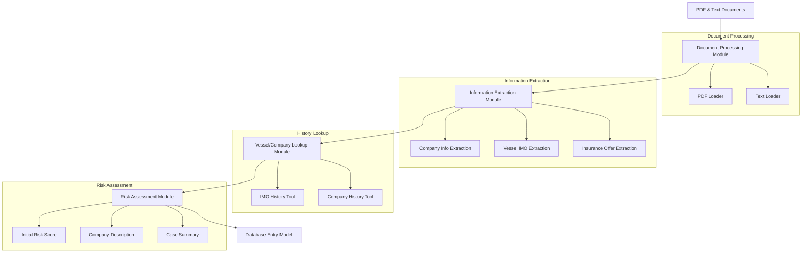

# LangChain Maritime Insurance Processing Tutorial - Implementation Plan

## Overview

We'll build a modular application that demonstrates how to use LangChain and LangGraph to process maritime insurance documents, extract key information, look up vessel and company history, and generate a risk assessment. The tutorial will focus on showing how to build a multi-step workflow while keeping the code concise for a 1.5-hour workshop.

## Architecture



## Project Structure

```
maritime_insurance_tutorial/
├── README.md
├── requirements.txt
├── data/
│   ├── company_info.pdf
│   ├── insurance_offer.pdf
│   ├── broker_email.txt
│   └── mock_data.py
├── src/
│   ├── main.py                  # Entry point that ties everything together
│   ├── document_processor.py    # Document loading and text extraction
│   ├── information_extractor.py # Extract key info from documents
│   ├── history_lookup.py        # Custom tools for IMO/company lookups
│   ├── risk_assessor.py         # Generate risk assessment and summaries
│   └── models.py                # Pydantic models for structured data
└── utils/
    └── graph_visualizer.py      # Optional: Visualize the LangGraph workflow
```

## Component Details

### 1. Document Processor (`document_processor.py`)

This module will handle loading and processing the PDF and text documents.

```python
from langchain_community.document_loaders import PyPDFLoader, TextLoader
from langchain.text_splitter import RecursiveCharacterTextSplitter

class DocumentProcessor:
    def load_pdf(self, file_path):
        """Load a PDF file and split into chunks"""
        loader = PyPDFLoader(file_path)
        documents = loader.load()
        return documents
        
    def load_text(self, file_path):
        """Load a text file"""
        loader = TextLoader(file_path)
        documents = loader.load()
        return documents
        
    def process_documents(self, pdf_paths, text_paths):
        """Process all documents and return combined content"""
        all_documents = []
        
        for pdf_path in pdf_paths:
            all_documents.extend(self.load_pdf(pdf_path))
            
        for text_path in text_paths:
            all_documents.extend(self.load_text(text_path))
            
        return all_documents
```

### 2. Information Extractor (`information_extractor.py`)

This module will extract key information from the processed documents using LangChain and LLMs.

```python
from langchain_openai import ChatOpenAI
from langchain.chains import create_extraction_chain
from langchain.prompts import ChatPromptTemplate
from pydantic import BaseModel, Field
from typing import List, Optional

# Define extraction schemas using Pydantic
class CompanyInfo(BaseModel):
    company_name: str = Field(description="The name of the shipping company")
    company_id: Optional[str] = Field(description="Company identifier if available")
    
class VesselInfo(BaseModel):
    vessel_name: str = Field(description="The name of the vessel")
    imo_number: str = Field(description="The IMO number of the vessel")
    
class InsuranceOffer(BaseModel):
    coverage_percentage: float = Field(description="Percentage of total insurance being offered")
    premium_amount: Optional[float] = Field(description="The premium amount if specified")
    coverage_type: str = Field(description="Type of insurance coverage")

class InformationExtractor:
    def __init__(self, model_name="gpt-4.1"):
        self.llm = ChatOpenAI(model=model_name)
    
    def extract_company_info(self, documents):
        """Extract company information from documents"""
        extraction_chain = create_extraction_chain(CompanyInfo, self.llm)
        results = extraction_chain.invoke({"input": "\n\n".join([doc.page_content for doc in documents])})
        return results["extracted"]
    
    def extract_vessel_info(self, documents):
        """Extract vessel information including IMO numbers"""
        extraction_chain = create_extraction_chain(VesselInfo, self.llm)
        results = extraction_chain.invoke({"input": "\n\n".join([doc.page_content for doc in documents])})
        return results["extracted"]
    
    def extract_insurance_offer(self, documents):
        """Extract insurance offer details"""
        extraction_chain = create_extraction_chain(InsuranceOffer, self.llm)
        results = extraction_chain.invoke({"input": "\n\n".join([doc.page_content for doc in documents])})
        return results["extracted"]
```

### 3. History Lookup (`history_lookup.py`)

This module will implement custom tools for looking up vessel and company history using mock data.

```python
from langchain.tools import BaseTool
from typing import Dict, List, Optional
from pydantic import BaseModel, Field

# Mock data for demonstration
from data.mock_data import VESSEL_HISTORY, COMPANY_HISTORY

class IncidentRecord(BaseModel):
    date: str
    description: str
    severity: str

class ClaimsRecord(BaseModel):
    date: str
    amount: float
    status: str
    description: str

class VesselHistoryInput(BaseModel):
    imo_number: str = Field(description="The IMO number of the vessel to look up")

class CompanyHistoryInput(BaseModel):
    company_name: str = Field(description="The name of the company to look up")

class VesselHistoryTool(BaseTool):
    name = "vessel_history_lookup"
    description = "Look up incident history and claims for a vessel by IMO number"
    args_schema = VesselHistoryInput
    
    def _run(self, imo_number: str):
        """Look up vessel history from mock data"""
        if imo_number in VESSEL_HISTORY:
            return VESSEL_HISTORY[imo_number]
        return {"incidents": [], "claims": [], "message": "No history found for this IMO number"}

class CompanyHistoryTool(BaseTool):
    name = "company_history_lookup"
    description = "Look up history and claims for a shipping company"
    args_schema = CompanyHistoryInput
    
    def _run(self, company_name: str):
        """Look up company history from mock data"""
        # Try case-insensitive match
        for company in COMPANY_HISTORY:
            if company_name.lower() in company.lower():
                return COMPANY_HISTORY[company]
        return {"incidents": [], "claims": [], "message": "No history found for this company"}
```

### 4. Risk Assessor (`risk_assessor.py`)

This module will generate risk assessments and summaries based on the extracted information and history lookups.

```python
from langchain_openai import ChatOpenAI
from langchain.chains import LLMChain
from langchain.prompts import ChatPromptTemplate
from pydantic import BaseModel, Field
from typing import List, Dict, Any

class RiskAssessment(BaseModel):
    risk_score: int = Field(description="Risk score from 1-10, where 10 is highest risk")
    company_description: str = Field(description="Brief description of the company")
    case_description: str = Field(description="Summary of the insurance case")
    recommendation: str = Field(description="Recommendation on whether to accept the insurance offer")

class RiskAssessor:
    def __init__(self, model_name="gpt-4.1"):
        self.llm = ChatOpenAI(model=model_name)
        
        self.risk_template = ChatPromptTemplate.from_template("""
        You are a maritime insurance risk assessor. Based on the following information, 
        provide a risk assessment with a risk score from 1-10 (10 being highest risk),
        a brief company description, a case summary, and a recommendation.
        
        Company Information:
        {company_info}
        
        Vessel Information:
        {vessel_info}
        
        Insurance Offer:
        {insurance_offer}
        
        Company History:
        {company_history}
        
        Vessel History:
        {vessel_history}
        
        Provide your assessment in a structured format with the following fields:
        - Risk Score (1-10)
        - Company Description (2-3 sentences)
        - Case Description (2-3 sentences)
        - Recommendation (Accept/Reject/Request More Information)
        """)
        
        self.risk_chain = LLMChain(llm=self.llm, prompt=self.risk_template)
    
    def generate_assessment(self, 
                           company_info: Dict, 
                           vessel_info: Dict, 
                           insurance_offer: Dict,
                           company_history: Dict,
                           vessel_history: Dict) -> RiskAssessment:
        """Generate a risk assessment based on all available information"""
        
        result = self.risk_chain.invoke({
            "company_info": str(company_info),
            "vessel_info": str(vessel_info),
            "insurance_offer": str(insurance_offer),
            "company_history": str(company_history),
            "vessel_history": str(vessel_history)
        })
        
        # Parse the LLM output into structured format
        # This is simplified for the tutorial - in a real app, we'd use more robust parsing
        lines = result["text"].strip().split("\n")
        risk_score = int([l for l in lines if "Risk Score" in l][0].split(":")[-1].strip())
        company_desc = [l for l in lines if "Company Description" in l][0].split(":")[-1].strip()
        case_desc = [l for l in lines if "Case Description" in l][0].split(":")[-1].strip()
        recommendation = [l for l in lines if "Recommendation" in l][0].split(":")[-1].strip()
        
        return RiskAssessment(
            risk_score=risk_score,
            company_description=company_desc,
            case_description=case_desc,
            recommendation=recommendation
        )
```

### 5. Models (`models.py`)

This module will define the Pydantic models for structured data throughout the application.

```python
from pydantic import BaseModel, Field
from typing import List, Optional, Dict

class Vessel(BaseModel):
    name: str
    imo_number: str
    
class Company(BaseModel):
    name: str
    company_id: Optional[str] = None
    vessels: List[Vessel] = []
    
class Incident(BaseModel):
    date: str
    description: str
    severity: str
    
class Claim(BaseModel):
    date: str
    amount: float
    status: str
    description: str
    
class History(BaseModel):
    incidents: List[Incident] = []
    claims: List[Claim] = []
    
class InsuranceDetails(BaseModel):
    coverage_percentage: float
    premium_amount: Optional[float] = None
    coverage_type: str
    
class RiskAssessment(BaseModel):
    risk_score: int = Field(ge=1, le=10)
    company_description: str
    case_description: str
    recommendation: str
    
class DatabaseEntry(BaseModel):
    """Final model for database entry"""
    company: Company
    vessels: List[Vessel]
    insurance: InsuranceDetails
    company_history: History
    vessel_histories: Dict[str, History]  # IMO number -> History
    assessment: RiskAssessment
```

### 6. Main Application (`main.py`)

This module will tie everything together using LangGraph to create a workflow.

```python
from langchain.graph import StateGraph, END
from typing import Dict, List, Any

from document_processor import DocumentProcessor
from information_extractor import InformationExtractor
from history_lookup import VesselHistoryTool, CompanyHistoryTool
from risk_assessor import RiskAssessor
from models import DatabaseEntry

def process_documents(state):
    """Process the documents and add them to the state"""
    processor = DocumentProcessor()
    documents = processor.process_documents(
        pdf_paths=state["pdf_paths"],
        text_paths=state["text_paths"]
    )
    return {"documents": documents}

def extract_information(state):
    """Extract key information from the documents"""
    extractor = InformationExtractor()
    company_info = extractor.extract_company_info(state["documents"])
    vessel_info = extractor.extract_vessel_info(state["documents"])
    insurance_offer = extractor.extract_insurance_offer(state["documents"])
    
    return {
        "company_info": company_info,
        "vessel_info": vessel_info,
        "insurance_offer": insurance_offer
    }

def lookup_history(state):
    """Look up vessel and company history"""
    vessel_tool = VesselHistoryTool()
    company_tool = CompanyHistoryTool()
    
    company_history = company_tool.run(state["company_info"][0]["company_name"])
    
    vessel_histories = {}
    for vessel in state["vessel_info"]:
        imo = vessel["imo_number"]
        vessel_histories[imo] = vessel_tool.run(imo)
    
    return {
        "company_history": company_history,
        "vessel_histories": vessel_histories
    }

def assess_risk(state):
    """Generate risk assessment"""
    assessor = RiskAssessor()
    
    # For simplicity, we'll just use the first vessel if multiple are found
    vessel_info = state["vessel_info"][0] if state["vessel_info"] else {}
    vessel_history = {}
    if vessel_info and "imo_number" in vessel_info:
        vessel_history = state["vessel_histories"].get(vessel_info["imo_number"], {})
    
    assessment = assessor.generate_assessment(
        company_info=state["company_info"][0] if state["company_info"] else {},
        vessel_info=vessel_info,
        insurance_offer=state["insurance_offer"][0] if state["insurance_offer"] else {},
        company_history=state["company_history"],
        vessel_history=vessel_history
    )
    
    return {"assessment": assessment}

def create_db_entry(state):
    """Create the final database entry model"""
    # This would be more complex in a real application
    # For the tutorial, we'll create a simplified version
    
    from models import Company, Vessel, InsuranceDetails, History, DatabaseEntry
    
    # Convert extracted data to our models
    company_data = state["company_info"][0] if state["company_info"] else {}
    company = Company(
        name=company_data.get("company_name", "Unknown"),
        company_id=company_data.get("company_id")
    )
    
    vessels = []
    for v in state["vessel_info"]:
        vessels.append(Vessel(
            name=v.get("vessel_name", "Unknown"),
            imo_number=v.get("imo_number", "Unknown")
        ))
    
    insurance_data = state["insurance_offer"][0] if state["insurance_offer"] else {}
    insurance = InsuranceDetails(
        coverage_percentage=insurance_data.get("coverage_percentage", 0),
        premium_amount=insurance_data.get("premium_amount"),
        coverage_type=insurance_data.get("coverage_type", "Unknown")
    )
    
    # Create the database entry
    db_entry = DatabaseEntry(
        company=company,
        vessels=vessels,
        insurance=insurance,
        company_history=state["company_history"],
        vessel_histories=state["vessel_histories"],
        assessment=state["assessment"]
    )
    
    return {"db_entry": db_entry}

def create_workflow():
    """Create the LangGraph workflow"""
    # Create the graph
    workflow = StateGraph(name="Maritime Insurance Processing")
    
    # Add nodes
    workflow.add_node("process_documents", process_documents)
    workflow.add_node("extract_information", extract_information)
    workflow.add_node("lookup_history", lookup_history)
    workflow.add_node("assess_risk", assess_risk)
    workflow.add_node("create_db_entry", create_db_entry)
    
    # Add edges
    workflow.add_edge("process_documents", "extract_information")
    workflow.add_edge("extract_information", "lookup_history")
    workflow.add_edge("lookup_history", "assess_risk")
    workflow.add_edge("assess_risk", "create_db_entry")
    workflow.add_edge("create_db_entry", END)
    
    # Compile the graph
    return workflow.compile()

def main():
    """Run the maritime insurance processing workflow"""
    # Create the workflow
    workflow = create_workflow()
    
    # Define input paths
    inputs = {
        "pdf_paths": [
            "data/company_info.pdf",
            "data/insurance_offer.pdf"
        ],
        "text_paths": [
            "data/broker_email.txt"
        ]
    }
    
    # Execute the workflow
    result = workflow.invoke(inputs)
    
    # Print the final database entry
    print("\n=== FINAL DATABASE ENTRY ===")
    db_entry = result["db_entry"]
    print(f"Company: {db_entry.company.name}")
    print(f"Vessels: {', '.join([v.name + ' (IMO: ' + v.imo_number + ')' for v in db_entry.vessels])}")
    print(f"Insurance: {db_entry.insurance.coverage_percentage}% coverage for {db_entry.insurance.coverage_type}")
    print(f"Risk Score: {db_entry.assessment.risk_score}/10")
    print(f"Recommendation: {db_entry.assessment.recommendation}")
    print("\nCompany Description:")
    print(db_entry.assessment.company_description)
    print("\nCase Description:")
    print(db_entry.assessment.case_description)
    
    return db_entry

if __name__ == "__main__":
    main()
```

### 7. Mock Data (`data/mock_data.py`)

This module will contain mock data for the vessel and company history lookups.

```python
# Mock vessel history data
VESSEL_HISTORY = {
    "9123456": {
        "incidents": [
            {"date": "2022-05-15", "description": "Minor collision with dock", "severity": "Low"},
            {"date": "2020-11-03", "description": "Engine failure", "severity": "Medium"}
        ],
        "claims": [
            {"date": "2022-05-16", "amount": 25000, "status": "Paid", "description": "Repairs for dock collision"},
            {"date": "2020-11-10", "amount": 75000, "status": "Paid", "description": "Engine replacement"}
        ]
    },
    "9234567": {
        "incidents": [],
        "claims": []
    },
    "9345678": {
        "incidents": [
            {"date": "2023-01-20", "description": "Fire in cargo hold", "severity": "High"},
            {"date": "2021-07-12", "description": "Piracy attempt", "severity": "High"},
            {"date": "2019-03-30", "description": "Navigation equipment failure", "severity": "Medium"}
        ],
        "claims": [
            {"date": "2023-01-25", "amount": 500000, "status": "Paid", "description": "Fire damage repairs"},
            {"date": "2021-07-15", "amount": 150000, "status": "Paid", "description": "Security upgrades after piracy attempt"},
            {"date": "2019-04-05", "amount": 50000, "status": "Paid", "description": "Navigation equipment replacement"}
        ]
    }
}

# Mock company history data
COMPANY_HISTORY = {
    "OceanTrans Shipping": {
        "incidents": [
            {"date": "2023-04-10", "description": "Environmental violation", "severity": "Medium"},
            {"date": "2021-09-22", "description": "Crew injury", "severity": "Medium"}
        ],
        "claims": [
            {"date": "2023-04-15", "amount": 100000, "status": "Paid", "description": "Fine for environmental violation"},
            {"date": "2021-09-25", "amount": 50000, "status": "Paid", "description": "Medical expenses for injured crew"}
        ]
    },
    "Global Maritime Ltd": {
        "incidents": [],
        "claims": []
    },
    "SeaWay Carriers": {
        "incidents": [
            {"date": "2022-12-05", "description": "Cargo damage due to improper stowage", "severity": "Medium"},
            {"date": "2022-02-18", "description": "Delay due to mechanical issues", "severity": "Low"},
            {"date": "2020-06-30", "description": "Collision with another vessel", "severity": "High"}
        ],
        "claims": [
            {"date": "2022-12-10", "amount": 200000, "status": "Paid", "description": "Compensation for damaged cargo"},
            {"date": "2022-02-20", "amount": 30000, "status": "Paid", "description": "Penalty for delay"},
            {"date": "2020-07-05", "amount": 750000, "status": "Paid", "description": "Repairs and liability for collision"}
        ]
    }
}
```

## Implementation Steps

1. **Set up the project structure**
   - Create the directory structure
   - Create empty files for each module

2. **Implement the mock data**
   - Create sample PDFs and text files
   - Implement the mock data dictionary

3. **Implement the document processor**
   - Set up the PDF and text loaders
   - Implement the document processing logic

4. **Implement the information extractor**
   - Define the extraction schemas
   - Implement the extraction chains

5. **Implement the history lookup tools**
   - Create the custom tools
   - Connect them to the mock data

6. **Implement the risk assessor**
   - Create the assessment chain
   - Implement the parsing logic

7. **Implement the models**
   - Define all the Pydantic models

8. **Implement the main workflow**
   - Create the LangGraph workflow
   - Connect all the components
   - Implement the main function

9. **Test the workflow**
   - Run the application with sample data
   - Verify the output

## Workshop Flow

1. **Introduction (10 minutes)**
   - Overview of the maritime insurance processing task
   - Introduction to LangChain and LangGraph

2. **Document Processing (15 minutes)**
   - Explain document loaders
   - Implement the document processor

3. **Information Extraction (15 minutes)**
   - Explain extraction chains
   - Implement the information extractor

4. **Custom Tools (15 minutes)**
   - Explain custom tools in LangChain
   - Implement the history lookup tools

5. **Risk Assessment (15 minutes)**
   - Explain LLM chains
   - Implement the risk assessor

6. **Workflow Creation (15 minutes)**
   - Explain LangGraph
   - Implement the main workflow

7. **Testing and Demonstration (15 minutes)**
   - Run the complete workflow
   - Discuss the results

8. **Q&A and Extensions (10 minutes)**
   - Answer questions
   - Discuss possible extensions

## Key Learning Points

1. How to use LangChain document loaders to process different file types
2. How to extract structured information from unstructured text
3. How to create custom tools for external data lookups
4. How to use LLMs for assessment and summarization
5. How to build a multi-step workflow using LangGraph
6. How to use Pydantic for data modeling and validation